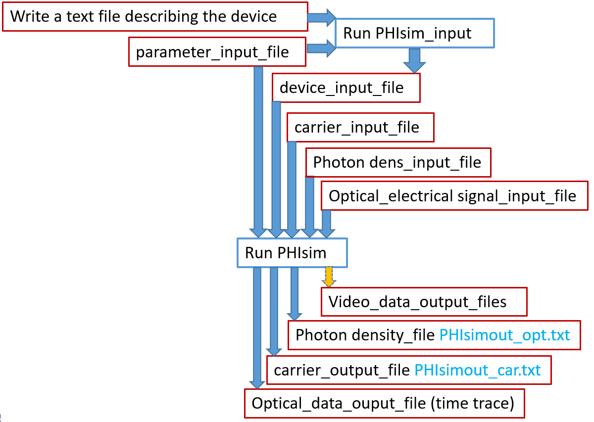

# Introduction

This project contains the code for the parallel simulation engine I developed in the context of my master's thesis. 
Its purpose is to speed up simulation work using PHIsim (https://sites.google.com/tue.nl/phisim/home). Note that this framework was designed specifically for PHIsimV3, and might require updates to work with different versions.

We achieve the parallelization by defining simulation objects that contain all necessary information for running a PHIsim instance; then we spin out these instances to separate processes.
The framework also allows you to define hooks to collect information from a simulation, so some of the data processing can also be parallelized. 

The framework was tested on computers with the Windows 10 and Windows 11 operating systems.

## Getting started

In a first step, before you start using this framework, it's best to have a working PHIsim simulation with (at least) one variation of the setup you want to test. In other words, you manually design your `device_input` file such that you have a device file that you know will work. The format of the `device_input` file is easy to understand, so it should be straightforward to create the `device_file` by hand. Then, you can use the python scripts published on the PHIsim website to run your simulation and debug any potential issues. If this is your first rodeo with PHIsim, this will allow you to familiarize yourself with the concepts used by the simulation.

## Using this framework

As a reminder, PHIsim actually consists out of 2 executables: 

- `PHsim_input.exe` which converts a textual description (which I called the `device_input` file earlier on) of your structure into a detailed device file
- `PHIsim.exe` which takes in the detailed device, along with a simulation parameters file and (optionally) an input signal file, and runs the actual simulation. After a simulation run, this executable writes 3 files: the optical output signals, and a carrier and photon density file. The former is generally what we're interested in, the latter 2 files can be used to continue the simulation with another run.

All of this is summarized in the following image (courtesy of prof. Erwin Bente):



The parallelization framework aims to automate these tasks. There are a lot of degrees of freedom here, so there are quite a few things to set up before we have a fully contained simulation object. 

### 1. Creating a flexible `device_file`

Starting from your working setup, create a function to write a parameterized `device_file`. Let's say that, for example, you have a simple setup with some waveguides and an SOA. The file would look like this:

```
IO_left__  8             # this always needs to be in the input file
paswg_L__  1   200       # passive waveguide on the left
soa_1____  2   100	 0   # 100 segm = amplifier 800 micron approx (100fs, 20wl segments)
paswg_R__  1   200       # passive waveguide on the right
IO_right_  9             # this always needs to be in the input file
-1 -1  # end of component list - start of connections list
IO_left__  R0 paswg_L__  L0    #
paswg_L__  R0 soa_1____  L0    #
soa_1____  R0 paswg_R__  L0    #
paswg_R__  R0 IO_right_  L0    #
xxx  -1  xxx -1  # end of connections list - start of current source list
0   0.1    # current in soa_1 in amps 0.2 amps = 13kA/cm2
-1 -1	   # end of current source list
From this point on the file can contain any text.
```

Let's say we want to have a parameterized waveguide and SOA length, and driving current. The corresponding python function would then become (for example):

```python
    def initialize_device_input_file(wg_segments, soa_segments, soa_current, device_filename):
        device_input_content = """\
IO_left__  8		            # this always needs to be in the input file
paswg_L__  1   {wg}               # passive waveguide on the left
soa_1____  2   {seg}	  0         # 100 segm = amplifier 800 micron approx (100fs, 20wl segments)
paswg_R__  1   {wg}               # passive waveguide on the right
IO_right_  9		            # this always needs to be in the input file
-1 -1               # end of component list - start of connections list
IO_left__  R0 paswg_L__  L0    #
paswg_L__  R0 soa_1____  L0    #
soa_1____  R0 paswg_R__  L0    #
paswg_R__  R0 IO_right_  L0    #
xxx  -1  xxx -1 	# end of connections list - start of current source list
0     {cur}    # current in soa_1 in amps 0.2 amps = 13kA/cm2
-1 -1	# end of current source list
From this point on the file can contain any text.
""".format(cur = soa_current, seg = soa_segments, wg = wg_segments)

        with open(device_filename, 'w') as f:
            f.write(device_input_content)
```

You see we put the device code in a string and replaced a few constants with variables (to have a variable device file) using `format` to fill those in. Then, we open a file and write the content there.

### 2. Defining the parameters of the simulation

The simulation has a lot of input parameters, which, broadly speaking, fall into two categories:
- The runtime parameters: how many cycles to run the simulation, the size of a segment, ...
- The physical parameters: material gain, losses, all sorts of coefficients to describe physical process, ...
  
Most of these parameters are contained within the `parameter_input_file` shown in the image. Since you may want to test some of these parameters in a simulation sweep, the parallel framework has some facilities to define them and write the parameter file. This is the class `PHIsim_SimulationParams` defined in the `PHIsim_sim_params.py` file, which also contains a variable `PHIsim_params_InGaAsP_ridge` with some useful physical constants, relevant for an InP ridge platform (YMMV). An example on how to use this could be:

```python 
import tools.PHIsim_sim_params as phip

# define a local copy, overwrite a few parameters
local_sim_params = phip.PHIsim_params_InGaAsP_ridge.copy(
    n_wavelen_segment = 5,
    nr_cycles         = 20000,
    # (for example) test with very low waveguide loss
    other_loss_pwg    = 0.001,
)

# create the parameter_input_file
local_sim_params.write_to_file() 
```

### 3. Define a signal input file

This may not be applicable in some cases, for example, if you're simulating a self-starting laser. In those cases, you can just leave the input signal file empty. If you do need an input signal, you will need to create a function to write that signal to a file. The framework provides some helper functions for a few common signal inputs (for example, a sech2 pulse) in the file `PHIsim_signal_input_util.py`. Some examples of how to use this can be found in the example simulation file `PHIsim_SOA_only_w_dispatcher.py`.

### 4. Define a simulation setup class

With everything above in place, we now need to tie all those elements together in a simulation object that contains all information on how to run a single PHIsim instance. This object will need to be a subclass of the abstract `PHIsim_ConcurrentSetup` class defined in `PHIsim_dispatcher.py`. You must initialize the base class with a `PHIsim_SimulationParams` instance and a local name, which will be used as the subfolder where simulations will be put. Then, each subclass must implement the `initialize_input_files()` method to write the required simulation input files in the assigned subfolder. 

A skeleton of this implementation, using the running example of a SOA test, would look like:

```python
from typing import override

import tools.PHIsim_sim_params as phip
import tools.PHIsim_dispatcher as phid

class TestSOASetup(phid.PHIsim_ConcurrentSetup):

    def __init__(self, sim_params : phip.PHIsim_SimulationParams, 
                      soa_len, soa_current, wg_len, signal_params):

        self.soa_segments = sim_params.length_to_num_segments(soa_len)
        self.wg_segments = sim_params.length_to_num_segments(wg_len)
        self.soa_current = soa_current
        self.signal_params = signal_params # assuming this is a structure containing signal power, type, duration, ...

        # assumes that soa_len and soa_current are the variable parameters and wg_len is a fixed parameter
        # embedding the variables in the work_folder name will make it easier to process the raw data later (if required)
        work_folder = "soa_{sseg}_segments_{scur}_mA".format(sseg=self.soa_segments, scur=(int)self.soa_current*1000)

        # initialize the base class
        super().__init__(sim_params, work_folder)

    @override
    def initialize_input_files(self):
        self.initialize_device_file()
        self.initialize_sim_parameter_file()
        self.initialize_signal_input_file()
        ## everything else defaults
        self.default_initialize_carrierfile()
        self.default_initialize_photond_file()
 
    def initialize_device_file(self):
        # use the function we defined earlier
        initialize_device_input_file(self.soa_segments, self.wg_segments, self.soa_current,
                                     self.signal_params.device_file)

    def initialize_sim_parameter_file(self):
        # this one's easy
        self.sim_params.write_to_file()

    def initialize_signal_input_file(self):
        # use self.signal_params and signal utilities to generate a signal, and write to file
        # ...
```

Take a moment to read that and try to understand what's happening. It should be relatively straightforward:
- We create new setup class `TestSOASetup` which inherits from the base class `PHIsim_ConcurrentSetup`
- This class has a constructor (the `__init__()` method) which takes in all parameters for a simulation run. Here, that's the simulation paramaters, model parameters and signal parameters. The constructor stores all parameters, creates a unique work-folder name based on these parameters, and initializes the base class.
- We override the `initialize_input_files()` function. Note that the `@override` annotation is optional, but I prefer having it to make it more obvious that this is an overriding method. We initialize the 5 different input files, but we can almost always use the `self.default_initialize_xxx()` for the carrierfile and photond file. So that leaves us with 3 files that need to be initialized: the device file, the simulations parameter file and the signal file. This is all done in this method.

### 5. Define a parameter sweep

We can now use the `TestSOASetup` class to define a parameter sweep and run the simulations. Let's say we want to run a set of simulations with SOA length between 100μm and 1mm with increments of 50μm, the code could look like this:

```python
# include all previous imports
import numpy as np

executables = phid.PHIsim_Executables("C:/PHIsim") # where PHIsim executables are installed
work_folder = "C:/Simulation_results/single_SOA_simulations" # folder to drop results

# use SI units for all dimensions
waveguide_len = 1e-3
soa_current = 0.1
local_sim_params = phip.PHIsim_params_InGaAsP_ridge.copy(
    # whatever we need to override here
)
signal_params = {} # parameters for the input signal, not implemented in this example

test_setups = []
for soa_len in np.linspace(1e-4, 1e-3, 19):
    test_setups.append(TestSOASetup(local_sim_params, soa_len, soa_current, waveguide_len, signal_params))

# run all simulations in parallel and get results
results = phid.PHIsim_run_concurrent(test_setups, work_folder, executables) 
```

More specifically, you want to create an *Iterable* of `PHIsim_ConcurrentSetup` objects and pass that to the `PHIsim_run_concurrent()` function. Here, I just created a list, which will be sufficient for most cases.

### 6. Process the results

After a simulation has run, you can process the results. The results object returned by `PHIsim_run_concurrent()` is a dictionary that maps a test setup to a `PHIsim_Result` object (also defined in `PHIsim_dispatcher.py`), which contains the output optical power and phase at both the left (L) and right (R) outputs. Suppose, for example, you want to calculate the total energy output during a simulation, you could calculate

```python
def energy_out(data, simulation_params, output_side):
    if output_side == "L":
        return np.sum(data.P_RL_out) * simulation_params.simulation_time_step()
    elif output_side == "R":
        return np.sum(data.P_LR_out) * simulation_params.simulation_time_step()

```
 and then get the energy output versus soa_length, 
```python

Eout_for_soa_len = {}
for (setup, result_data) in results.items():
    # actual length may differ slightly from input length due to rounding 
    actual_soa_len = setup.sim_params.simulation_segment_length(setup.soa_segments) 
    output_energy_L = energy_out(result_data, setup.sim_params, "L") # function defined above
    Eout_for_soa_len[actual_soa_len] = output_energy_L
```
After this, the variable `Eout_for_soa_len` will contain the output energy (on the left side) for different SOA lengths with the same driving current. This can then be used, for example, for further processing, or plotting a curve. 

Although this particular value is probably not very interesting, it serves as an example of how the result data can be processed. The example file `PHIsim_SOA_only_w_dispatcher.py` contains more complicated examples and some plotting.